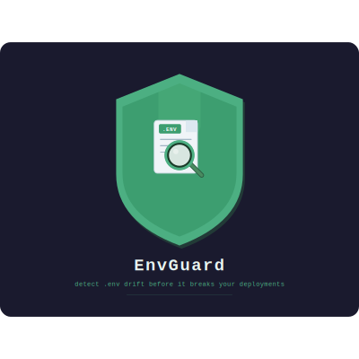

<div align="center">



<br/>

# EnvGuard

**Detect `.env` drift before it breaks your deployments.**

[](https://www.nuget.org/packages/EnvGuard)
[](https://github.com/YOUR_USERNAME/EnvGuard/actions/workflows/ci.yml)
[](LICENSE)
[](https://dotnet.microsoft.com)

</div>

---

## The problem

Someone adds `STRIPE_WEBHOOK_SECRET` to their `.env` during the week.  
Forgets to update `.env.example`. Code review doesn't catch it — `.env` is in `.gitignore`.  
CI passes. Production breaks at 2am.

**EnvGuard catches it before the deploy.**

---

## Install

```bash
dotnet tool install -g EnvGuard
```

---

## Usage

```bash
# Compare two .env files and show divergences
envguard diff .env .env.production

# Strict mode — exit code 2 if any key is missing
envguard diff .env .env.example --strict

# JSON output for pipelines
envguard diff .env .env.prod --json | jq .onlyInB

# Hide sensitive values in terminal output
envguard diff .env .env.prod --hide-values

# Auto-generate a .env.example from your real .env
envguard generate .env --output .env.example
```

---

## Output

```
────────────────── EnvGuard · .env vs .env.production ──────────────────

✓ 12 identical variables

✗ Only in .env (1):
  STRIPE_WEBHOOK_SECRET

✗ Only in .env.production (1):
  SENTRY_DSN

⚠ Different values (1):
┌──────────────────┬──────────────────┬──────────────────┐
│ Variable         │ .env             │ .env.production  │
├──────────────────┼──────────────────┼──────────────────┤
│ DATABASE_URL     │ postgres://loc…  │ postgres://pro…  │
└──────────────────┴──────────────────┴──────────────────┘

3 divergence(s) found.
```

---

## Exit codes

| Code | Meaning                          |
|------|----------------------------------|
| `0`  | No differences found             |
| `1`  | Differences found                |
| `2`  | Strict mode — required keys missing |
| `3`  | File not found                   |

Exit codes are the CLI's public API — stable across versions.

---

## CI integration

Add to any GitHub Actions workflow:

```yaml
- name: Check .env drift
  run: envguard diff .env.example .env.ci --strict
```

A non-zero exit code fails the step and surfaces the diff in the logs.

---

## Architecture

EnvGuard is a single .NET 10 console app with three internal layers:

```
Commands/   →   orchestration (System.CommandLine)
Core/       →   pure logic — EnvParser + EnvComparer (zero external deps)
Output/     →   presentation — ConsoleRenderer (Spectre.Console) + JsonRenderer
```

The `Core/` layer has no external dependencies. This means:
- Tests need no mocks — pure input/output
- The logic can be extracted as a library without refactoring

---

## Roadmap

- [x] `diff` command with colored output
- [x] `--strict`, `--json`, `--hide-values` flags
- [x] `generate` command
- [x] xUnit tests with full coverage on Core
- [x] CI/CD with GitHub Actions + NuGet publish on tag
- [ ] Multi-file comparison with consolidated report
- [ ] GitHub Action for Marketplace (no .NET install required)
- [ ] PR comment with drift summary on changed `.env.example`
- [ ] `watch` mode with real-time drift detection

---

## Contributing

Issues and PRs are welcome.  
For larger changes, open an issue first to discuss the approach.

```bash
git clone https://github.com/YOUR_USERNAME/EnvGuard
cd EnvGuard
dotnet restore
dotnet test
```

---

## License

[MIT](LICENSE) — Vitor, 2026
